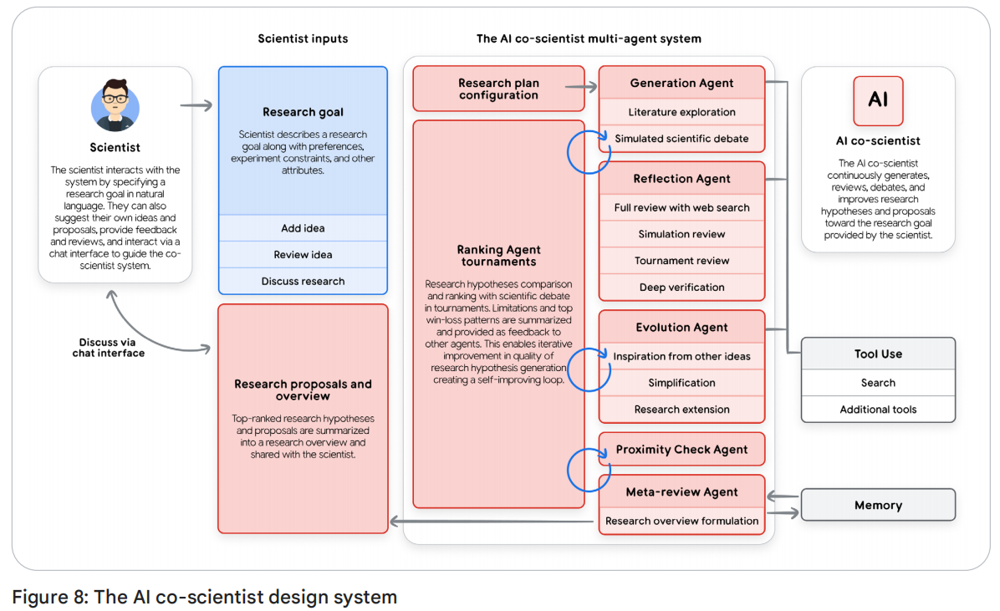

# 智能体介绍

作者：艾伦·布朗特、安东尼奥·古利、舒巴姆·萨布、迈克尔·齐默曼和弗拉基米尔·武斯科维奇

Authors: Alan Blount, Antonio Gulli, Shubham Saboo, Michael Zimmermann, and Vladimir Vuskovic

致谢

内容贡献者

陈恩里克（Enrique Chan）

迈克·克拉克（Mike Clark）

德里克·伊根（Derek Egan）

阿南特·纳瓦尔加里亚（Anant Nawalgaria）

坎查娜·帕特洛拉（Kanchana Patlolla）

朱莉娅·维辛格（Julia Wiesinger）

策展人与编辑

阿南特·纳瓦尔加里亚（Anant Nawalgaria）

坎查娜·帕特洛拉（Kanchana Patlolla）

设计师

迈克尔·兰宁（Michael Lanning）

> 智能体是语言模型的自然演进，使其在软件中发挥实际作用。

## 从预测AI到自主智能体

人工智能正在发生变革。多年来，人们的关注点一直集中在擅长执行被动式、离散任务的模型上：比如回答问题、翻译文本，或根据提示生成图像。尽管这种模式功能强大，但它每一步都需要人类持续指导。如今，我们正目睹一场范式转变——从仅能预测或创作内容的人工智能，迈向一类能够自主解决问题并执行任务的新一代软件。

这一新领域以AI智能体为核心。智能体并不仅仅是静态工作流中的一个AI模型，而是一个完整的应用，能够制定计划并采取行动以实现目标。它将语言模型（LM）的推理能力与实际的执行能力完美结合，从而赋予它能够处理复杂的多步骤任务，而单靠模型是无法完成的。关键能力在于，智能体可以自主行动，自行判断达成目标所需的下一步骤，无需人工全程引导。

本文是五部分系列中的第一篇，旨在为从概念验证阶段向稳健的、适用于生产环境的智能系统过渡的开发者、架构师及产品负责人提供一份正式指南。尽管构建简单原型看似容易，但确保系统的安全性、质量和可靠性却是一项重大挑战。本文将为此奠定全面的基础：

• **核心架构**：将智能体拆解为三个核心组件：推理模型、可操作工具，以及掌控全局的编排层。

• **能力分类学**：从简单、互联的问题解决者，到复杂、协作的多智能体系统，对智能体进行分级分类。

• **架构设计**：深入探讨从模型选择到工具实施的各个组件的实际设计考量。

• **为生产打造**：建立智能体运营规范，确保能够从单个实例到大规模集群，系统化地评估、调试、保障安全并实现智能系统的企业级治理与扩展。

本指南基于此前发布的[《Agent 白皮书1》](https://www.kaggle.com/whitepaper-agents)和[《Agent Companion2》](https://www.kaggle.com/whitepaper-agent-companion)；它为您成功构建、部署及管理这一新一代智能应用提供了必备的基础概念与战略框架——这些应用具备推理、行动与观察能力，能够高效达成目标。

> 语言不足以描述人类与人工智能的互动方式。我们倾向于赋予AI拟人化特征，习惯用“思考”“推理”“知道”等人类特有的词汇来表达。然而，目前我们尚无专门的词语来区分“具有语义意义的知识”与“能极大化奖励函数、具有高概率的知识”。事实上，这两种“知道”虽然本质不同，但其结果却有99.X%的概率完全一致。

## 一、智能体简介

简而言之，AI智能体是模型、工具、编排层及运行时服务的组合，它通过循环利用语言模型来实现特定目标。这四个要素共同构成了任何自主系统的核心架构。

• 模型（"大脑"）：作为智能体核心推理引擎的核心语言模型（LM）或基础模型，用于处理信息、评估选项并做出决策。模型的类型（通用型、微调型或多模态型）决定了智能体的认知能力。而一个智能体系统则是LM所用输入上下文窗口的最终管理者。

• 工具（"双手"）：这些机制将智能体的推理能力与外部世界连接起来，使其能够执行超越文本生成的行动。它们包括API扩展、代码函数，以及数据存储（如数据库或向量存储），用于访问实时、基于事实的信息。在一个智能体系统中，语言模型能够自主规划使用哪些工具，执行相应操作，并将工具的运行结果纳入下一次语言模型调用的输入上下文窗口中。

• 编排层（“神经系统”）：负责管理智能体运行循环的控制流程，涵盖规划、记忆（状态）以及推理策略的执行。该层采用提示框架和推理技术（如链式思考或ReAct），用于将复杂目标分解为多个步骤，并决定何时应进行思考，何时该使用工具。此外，这一层还负责赋予智能体“记忆”能力，使其能够“记住”相关信息。

• 部署（"身体与腿部"）：尽管在笔记本电脑上构建智能体有助于快速原型设计，但真正使其成为可靠且易于访问的服务的关键在于生产环境的部署。这包括将智能体托管到安全、可扩展的服务器上，并将其集成至关键的生产服务中，以实现监控、日志记录和管理功能。部署完成后，用户可通过图形界面访问该智能体，或通过智能体间API（A2A API）让其他智能体以编程方式调用。

归根结底，构建一个生成式AI智能体，是一种全新的方式，旨在为任务解决提供创新性方案。传统开发者更像是“砌砖匠”，需精确定义每一个逻辑步骤；而智能体开发者则更像一位导演——你无需为每个动作编写明确的代码，而是先搭建好场景（即引导性的指令和提示），挑选合适的演员（工具与API），并提供必要的背景信息（数据）。这样一来，你的主要任务便转变为如何引导这位自主“演员”，使其完美呈现预期的表演效果。

你会很快发现，语言模型最强大的优势——其令人难以置信的灵活性——同时也成了你最大的难题。由于大型语言模型具备无所不能的能力，因此很难确保它能可靠、完美地完成某一项特定任务。过去我们称之为“提示工程”，如今则称为“上下文工程”，正是通过这种方式引导语言模型生成所需的输出。对于每次调用语言模型时，我们会输入指令、事实信息、可调用的工具示例、会话历史记录、用户画像等，将恰当的信息填入上下文窗口，从而获得理想的结果。而智能体则是负责管理语言模型输入的软件，以帮助完成各项任务。

当问题出现时，调试便显得至关重要。"Agent Ops"本质上重新定义了熟悉的测量、分析与系统优化循环。通过追踪和日志，你可以监控智能体的"思维过程"，从而发现其与预期执行路径之间的偏差。随着模型的不断演进和框架的持续改进，开发者的职责是提供所需的关键要素：领域专业知识、明确的个性特征，以及与完成实际任务所需工具的无缝整合。务必记住，全面的评估和分析往往比最初的提示更具影响力。

当一个智能体经过精准配置，拥有清晰的指令、可靠的工具，以及作为记忆的整合式上下文；同时具备出色的用户界面、规划与问题解决能力，还掌握着广泛的世界知识时，它便超越了单纯"工作流自动化"的概念——开始真正发挥协同作用：成为团队中一位高效卓越、灵活应变且实力非凡的新成员。

本质上，智能体是一种专门致力于上下文窗口策划的系统。它是一个永不停歇的循环：不断整合上下文，向模型发出提示，观察生成的结果，然后再为下一步重新构建上下文。这些上下文可能包括系统指令、用户输入、会话历史、长期记忆、来自权威来源的基础知识，以及可使用的工具和已调用工具的执行结果。通过这种对模型注意力的精细化管理，其推理能力得以应对全新情境，并最终实现既定目标。

### 1.1 智能体的问题求解过程

我们已将AI智能体定义为一种完整的、以目标为导向的应用程序，它集成了推理模型、可操作工具以及一个核心的编排层。简而言之，"**循环中的语言模型，搭配工具，以实现特定目标。**"

但这个系统究竟是如何运作的？从智能体接收到请求到最终交付结果，它具体做了些什么？

本质上，智能体通过一个持续的循环过程来实现其目标。尽管这一流程可能变得极为复杂，但正如《[agentic System Design](https://www.amazon.com/Agentic-Design-Patterns-Hands-Intelligent/dp/3032014018)》一书中详细探讨的那样，我们可以将其分解为五个基本步骤：

1. **确定任务**：这一过程由一个明确的、高层次的目标启动。该任务可由用户提出（例如："为团队即将举行的会议安排差旅"），或通过自动触发机制启动（例如："收到一个新的高优先级客户工单"）。
2. **扫描场景**：智能体会感知其所在环境，以获取相关背景信息。这包括编排层访问其可用资源：“用户请求的内容是什么？”，“我的术语记忆中有哪些信息？我是否已尝试过完成这项任务？用户上周是否曾给我提供过指导？”，“我能从我的工具（如日历、数据库或API）中调用哪些功能？”
3. **仔细思考**：这是智能体的核心“思考”循环，由推理模型驱动。智能体首先将任务（步骤1）与场景（步骤2）进行分析，并制定计划。这并非单一的思考过程，而通常是一系列推理的链条：“要预订行程，我首先需要知道团队中都有哪些成员，我会使用‘get_team_roster’工具；接着，我还需要通过‘calendar_api’检查他们的可用性。”
4. **采取行动**：编排层执行计划的第一步具体操作。它会选择并调用合适的工具——无论是调用API、运行代码函数，还是查询数据库。这正是智能体基于自身内部推理，真正作用于外部世界的行为。
5. **观察并迭代**：智能体观察其行动的结果。get_team_roster工具会返回一个包含五个名字的列表。这些新信息会被添加到智能体的上下文或"记忆"中。随后，循环再次启动，回到步骤3："现在我已获得名单，下一步是查看这五个人的日程安排。我将使用calendar_api。"

这个"思考、行动、观察"的循环持续进行——由编排层管理，经模型推理，并由工具执行，直至智能体的内部计划完成，最终实现初始任务目标。

让我们以一个真实案例来说明客户支持专员如何在这5步循环中运作：

想象一下，有用户问：“我的订单#12345在哪里？”

智能体并未立即采取行动，而是首先进入“仔细思考”阶段，以制定完整的策略。它这样推理：

“用户想要查询配送状态。为了给出完整答案，我需要一个分步计划：”

1. 确认：我首先需要在我们的内部数据库中找到该订单，以确认其存在并获取详细信息。
2. 追踪：我会从这些详细信息中提取出物流公司的跟踪号码，然后通过外部物流公司的API查询实时状态。
3. 报告：最后，我必须将所收集的信息整合成一份清晰、实用的答复，提供给用户。

牢记这一多步骤计划，该智能体开始执行。

在第一阶段的“执行”中，它执行了计划的第一步，即调用 `find_order("12345")`工具。随后，它观察到结果——一个完整的订单记录，其中包括跟踪号码"ZYX987"。

智能体的编排层识别到其计划的第一部分已完成，随即进入第二步。它通过调用 `get_shipping_status("ZYX987")`工具来执行操作，并观察到新的结果："已发运待送。"

最后，智能体成功完成了计划中的数据收集阶段，随即进入“报告”步骤。它认为自己已具备所有必要组件，开始规划最终信息，并付诸行动，生成回复：“您的订单号#12345已‘准备发货’！”

## 二、智能体系统的分类体系

理解5步操作循环是解开谜题的第一步。第二步则是认识到，这一循环的复杂度可以灵活扩展，从而打造出不同类型的智能体。对于架构师或产品负责人而言，最初的关键决策在于明确要构建哪种类型的智能体。

我们可以将智能系统划分为几个大致的层次，每一层都在前一层的能力基础上进一步发展。

### 2.1 Level 0：纯模型推理

在我们能够拥有智能体之前，必须从“大脑”的最基本形式入手：即推理引擎本身。在这种配置下，语言模型（LM）独立运行，完全基于其庞大的预训练知识库作出响应，而无需任何工具、记忆，也无需与实时环境互动。

它的优势在于这种广泛的训练，使其能够深入阐释既定概念，并规划出解决复杂问题的思路。但相应的，它完全缺乏实时感知能力——在训练数据之外，它实际上对任何事件或事实都"视而不见"。

例如，它能解释职业棒球的规则以及纽约洋基队的完整历史。但如果你问：“昨晚洋基队比赛的最终比分是多少？”它却无法回答。因为那场比赛是训练数据收集之后发生的特定现实事件，相关信息根本不存在于它的知识库中。

### 2.2 Level 1：工具调用

在这个层次上，推理引擎通过连接并调用外部工具——我们架构中的“双手”组件——成为了一个功能型智能体。它的问题解决能力不再局限于自身静态的、预先训练好的知识范围。

借助5步循环，该智能体现在能够回答我们之前的问题。针对任务"昨晚洋基队比赛的最终比分是多少？"，其"思考"步骤识别出这是一个需要实时数据的需求；随后，"执行"步骤会调用相应工具，例如带有准确日期和搜索关键词的Google搜索API。接着，"观察"搜索结果（如"洋基队以5比3获胜"），并将其整合为最终答案。

这种与世界互动的基本能力——无论是通过搜索工具查找信息、利用金融API获取实时股价，还是借助检索增强生成（RAG）技术访问数据库——正是Level 1智能体的核心功能。

### 2.3 Level 2：上下文工程

第二层级标志着能力的显著提升，从执行简单任务迈向战略性规划复杂且多步骤的目标。此时浮现的关键技能是上下文工程：即智能体能够主动选择、整合并管理每一步计划中最相关的信息。

智能体的准确性取决于专注且高质量的上下文。上下文工程通过引导模型将有限注意力集中在关键信息上，以避免过载，并确保高效运行。

例如，考虑以下任务：“寻找一家位于我位于山景城安菲剧场大道1600号的办公室与旧金山市场街1号客户办公室之间的理想咖啡店。”

二级智能体将开始制定计划：

1. 想：“我必须先找到中点。”

    • 操作：使用两个地址调用地图工具。

    • 注意：“中途站是加州米尔布雷。”

2. 思考：“现在我得在米尔布雷找咖啡店。用户要求‘好’的店，所以我将搜索评分4星或以上的场所。”

    • 操作：调用`google_places`工具，查询“加州米尔布雷的咖啡馆”，最低评分4.0。（这是上下文工程——它根据上一步的输出自动创建了一个新的、更聚焦的搜索查询）。

    • 注意：“搜索结果返回了‘米尔布雷咖啡’和‘每日研磨’。”

3. 思考：“我将综合这些结果，并将其呈现给用户。”

这种战略规划还能够实现主动式协助，例如，一个客服智能体读取冗长的航班确认邮件后，精准提取关键信息（如航班号、日期），并自动将其添加到你的日程表中。

### 2.4 Level 3：多智能体协作

在最高层面，范式发生了彻底转变。我们不再致力于打造一个单一、无所不能的“超级智能体”，而是转向由一群各司其职的“专业团队”协同合作的模式——这种模式恰恰与人类组织如出一辙。正是这种分工协作，构成了系统整体的强大优势。

在这里，智能体将其他智能体视为工具。想象一下，"项目经理"智能体收到一条"任务"："推出我们全新的'Solaris'耳机。"

项目经理智能体并不会独自完成所有工作。它通过为自己的专业智能体团队创建新任务来发挥作用，这与现实中的运作方式如出一辙：

1. 致市场调研专员：“请分析竞争对手的降噪耳机定价，并于明天前提交一份总结报告。”
2. 致市场专员：“请以‘Solaris’产品规格表为依据，拟定三版新闻稿。”
3. 致Web开发智能体："请根据所附的设计样稿，生成新的产品页面HTML代码。"

尽管目前这种协作模式受限于当前语言模型的推理能力，但它代表了从头到尾自动化完整、复杂业务流程的前沿方向。

### 2.5 Level 4：自进化系统

第四层级标志着从单纯授权到自主创造与适应的深刻飞跃。在这一层级，智能体系统能够识别自身能力中的不足，并动态地创建新工具，甚至全新智能体来弥补这些短板。它不再局限于使用固定资源，而是主动拓展自身的功能边界。

按照我们的示例，“项目经理”这一负责“Solaris”项目启动的岗位，可能会意识到自己需要监控社交媒体上的舆论情绪，但团队中却并未配备相应的工具或智能体。

1. 思考（元推理）：“我必须关注“Solaris”的社交媒体热度，但我缺乏相应的能力。”
2. 行动（自主创建）：与其失败，它会调用一个高级的智能体创建器工具，并赋予其新任务："构建一个新智能体，用于监测社交媒体中是否出现关键词'Solaris耳机'，执行情感分析，并每日生成总结报告。"
3. 观察：系统会迅速创建、测试一个全新、专业的情感分析智能体，并即时加入团队，随时准备为原定任务贡献力量。

这种自主性使系统能够动态扩展自身能力，从而将一群智能体转变为真正具备学习与进化能力的组织。

## 三、核心架构设计：

我们知道智能体的作用及其扩展方式，但究竟该如何构建它呢？从概念到代码的转化，关键在于其三个核心组件的具体架构设计。

### 3.1 模型层(大脑)

语言模型是智能体的推理核心，其选择是一项至关重要的架构决策，它将直接影响智能体的认知能力、运行成本以及处理速度。然而，仅仅根据模型在通用基准测试中的最高得分来决定，往往是一条通往失败的常见路径。事实上，智能体在实际生产环境中的表现，很少能单纯由学术界的通用基准来衡量。

现实世界的成功需要一种在智能体基础能力上表现卓越的模型：具备出色的推理能力，以应对复杂、多步骤的问题；同时拥有可靠的工具使用能力，以便与世界互动。

要做好这一点，首先要明确业务问题，然后根据与该结果直接相关的指标来测试模型。如果你的智能体需要编写代码，就应在你的私有代码库上进行测试；如果它用于处理保险理赔，则需评估其从你特定文档格式中提取信息的能力。随后，这一分析还需结合成本和延迟的实际考量。对于你的具体任务而言，“最佳”模型正是那个在质量、速度与价格三者之间达到最优平衡点的模型。

你可以选择不止一种模型，组建一个“专家团队”。破解坚果无需动用大锤——同样，强大的智能体架构可以采用Gemini 2.5 Pro等前沿模型来承担初期规划和复杂推理的繁重任务，但随后会智能地将那些简单、高频率的任务——比如用户意图分类或文本摘要——分流至更快速、更具成本效益的Gemini 2.5 Flash模型。模型路由既可自动实现，也可通过硬编码完成，但无论哪种方式，这都是优化性能与成本的关键策略之一。

同样的原则也适用于处理多样化数据类型。虽然像Gemini实时模式这样原生支持多模态的模型能够为图像和音频的处理提供一条简化路径，但另一种选择是使用 `Cloud Vision API`或 `Speech-to-Text API`等专业工具。在这种模式下，首先将世界内容转换为文本，再将其传递给仅处理语言的模型进行推理。这种方式既增加了灵活性，使用户能选用最适合的组件，同时也带来了显著的复杂性。

最终，AI领域正处于持续、快速的演进之中。今天你选择的模型，六个月后可能就会被取代。"一劳永逸"的思维模式已难以为继。要应对这一现实，关键在于构建一套灵活高效的运营框架——即"Agent Ops"实践。通过建立强大的CI/CD流水线，定期将新模型与你的核心业务指标进行对比评估，你不仅能有效降低风险、加速升级，还能确保始终让智能体团队搭载最顶尖的技术支持，而无需对整个架构进行全面颠覆性改造。

### 3.2 工具层(手)

如果模型是智能体的大脑，那么工具就是连接其推理与现实的双手。它们使智能体能够超越静态的训练数据，实时获取信息，并在现实中采取行动。一个强大的工具接口由三部分构成：明确工具的功能、调用工具，以及观察执行结果。

以下是工具智能体构建者将交到其智能体“手中”的几种主要类型。如需更深入的了解，请参阅本系列中专门介绍智能体工具的白皮书。

#### 3.2.1 信息检索

最基础的工具是能够获取最新信息的能力。检索增强生成（RAG）为智能体提供了一张“借书证”，使其能够查询外部知识——这些知识通常存储于向量数据库或知识图谱中，涵盖从公司内部文档到通过谷歌搜索获取的网络知识等多种来源。对于结构化数据，自然语言转SQL（NL2SQL）工具则使智能体能够直接查询数据库，轻松解答诸如“上个季度我们的畅销产品有哪些？”这类分析性问题。通过在表达前先查找相关信息——无论是来自文档还是数据库——智能体得以立足于事实，从而大幅降低幻觉现象的发生。

#### 3.2.2 任务执行

当智能体从被动读取信息转变为主动行动时，其真正潜能便得以释放。通过将现有API和代码功能封装为工具，智能体能够轻松发送电子邮件、安排会议，或在ServiceNow中更新客户记录。而对于更复杂的任务，智能体甚至可即刻编写并执行代码——在安全的沙盒环境中，它能生成SQL查询或Python脚本，快速解决棘手问题或完成复杂计算，从而从一名知识丰富的助手，蜕变为一位自主行动的“实干家”。

这还包括用于人类交互的工具。智能体可以使用"人工介入式学习"（HITL）工具，暂停其工作流程并请求确认（例如，ask_for_confirmation()），或从用户界面中获取特定信息（例如，ask_for_date_input()），从而确保关键决策需要人工参与。HITL还可通过短信和数据库中的任务来实现。

#### 3.2.3 工具调用

为了使智能体能够可靠地执行“函数调用”并使用工具，它需要清晰的指令、安全的连接以及高效的编排。长期以来，OpenAPI 规范等标准为此提供了支持，为智能体构建了一种结构化的契约，详细描述了工具的功能、所需参数及其预期响应。这种模式使模型能够每次都准确生成相应的函数调用，并正确解析 API 响应。此外，对于更简单的工具发现与连接方式，Model Context Protocol（MCP）等开放标准因其便捷性而日益受到青睐。值得一提的是，目前已有部分模型内置了原生工具，例如 Gemini 集成了原生 Google 搜索功能，使得函数调用直接作为语言模型调用的一部分自动完成。

### 3.3 编排层

如果语言模型是智能体的大脑，工具则是它的双手，那么编排层便是连接两者的中枢神经系统。它正是驱动“思考、行动、观察”循环的引擎，也是掌控智能体行为状态机的核心所在，更是开发者精心设计的逻辑得以真正落地实现的地方。这一层绝非简单的基础设施——它犹如整场智能体交响乐的指挥家，决定着何时让模型展开推理、选择由哪项工具采取行动，以及如何将行动结果反馈并引导下一阶段的演进。

#### 3.3.1 框架选型

第一个建筑决策是确定智能体的自主程度。这一选择存在于一个连续谱上：一端是确定性的、可预测的工作流程，它们将语言模型（LM）作为执行特定任务的工具——即通过少量人工智能来增强现有流程；而另一端则是让语言模型完全主导，动态适应、规划并执行任务，以实现最终目标。

另一种选择是实现方式。无代码构建工具兼具速度与易用性，能让业务用户轻松自动化结构化任务，并快速搭建简单智能体。而对于更为复杂、关乎核心业务的系统，以代码为先的框架——例如谷歌推出的智能体开发套件 `Agent Development Kit(ADK)`——则能提供工程师所需的深度控制力、高度可定制性以及强大的集成能力。

无论采用何种方法，一个生产级框架都是至关重要的。它必须是开放的，允许你灵活接入任何模型或工具，以避免供应商锁定问题。同时，框架需提供精准的控制能力，支持混合式架构——即通过硬编码的业务规则来管理大型语言模型那种非确定性推理过程。最重要的是，这个框架必须专为可观测性而设计。当智能体的行为出现意外时，你无法简单地在模型的“思考”环节设置断点——相反，一个强大的框架应能生成详尽的追踪记录与日志，完整呈现推理的每一步轨迹：包括模型的内部独白、它所选择的工具、生成的参数，以及最终观察到的结果。

#### 3.3.2 领域知识和个性化

在这个框架中，开发者最有力的抓手就是以领域知识和鲜明的人设来指导智能体。这通过系统提示或一组核心指令来实现。这不仅仅是一条简单的命令，更是智能体的内在"基因"。

在这里，你要明确告知它：“你是一名为Acme公司提供帮助的客服助理……”并详细说明约束条件、期望的输出格式、互动规则、特定的语气风格，以及何时何地应使用其工具的明确指导。通常，在说明中加入几个示例场景会非常有效。

#### 3.3.3 增强上下文

智能体的"记忆"会在运行时被整合进语言模型的上下文窗口中。如需更深入的了解，敬请参阅本系列中专门探讨智能体记忆的白皮书。

短期记忆是智能体的"即时存储器"，用于保存当前对话的实时历史记录。它会跟踪正在进行的循环中一系列的（动作，观察）配对，为模型提供当下所需的上下文，以决定下一步该采取什么行动。这一机制可以实现为状态、物品、会话或线程等抽象概念。

#### 3.3.4 多智能体系统和设计模式

随着任务复杂度的提升，构建一个单一的、无所不能的"超级智能体"变得效率低下。更有效的解决方案是采用"专家团队"的方法，这与人类组织的运作方式如出一辙。这正是多智能体系统的核心所在：一个复杂的流程被划分为独立的子任务，每个子任务都分配给专门、擅长的AI智能体。这种分工方式使每个智能体更加简单、专注，也更易于构建、测试和维护，非常适合动态或长期运行的业务流程。

开发者可以依赖经过验证的智能体设计模式，但随着智能体能力的快速演进，这些模式本身也在不断变化。对于动态或非线性任务而言，协调器模式(Coordinator)至关重要。它引入了一个“管理者”智能体，负责分析复杂请求，将主任务分解，并智能地将每个子任务分配给相应的专业智能体（如研究员、撰稿人或编码员）。随后，协调器会整合各专业智能体的回复，最终形成完整而全面的答案。

对于更线性的工作流程，顺序模式更为合适，它就像一个数字化的流水线，一个智能体的输出直接成为下一个智能体的输入。其他关键模式则侧重于质量和安全。迭代改进模式创建了一个反馈循环，使用"生成"智能体来创建内容，并由"批判性"智能体根据质量标准进行评估。对于高风险任务，人机协作（HITL）模式至关重要，它在工作流程中有意设置暂停，以便在智能体采取重大行动前获得人工批准。

### 3.4 智能体部署和服务

在你构建好本地智能体后，接下来需要将其部署到服务器上，以便它能始终运行，并供其他人及其他智能体使用。继续之前的比喻，部署和服务就如同我们智能体的"身体"和"双腿"。一个高效的智能体需要多种服务支持，例如会话历史记录、记忆持久化功能等。作为智能体的开发者，你还需要负责决定记录哪些内容，以及采取哪些安全措施，以确保数据隐私、数据本地化存储，并符合相关法规要求。这些服务都是将智能体正式投入生产环境时必须涵盖的范围。

幸运的是，智能体开发者可以依赖数十年积累的应用托管基础设施。毕竟，智能体本身就是一种新型软件，许多相同的原则同样适用。开发者可以信赖专为智能体量身打造的部署选项，例如Vertex AI Agent Engine，它能在同一平台上无缝支持运行时及其他所有功能。而对于希望更直接掌控应用堆栈、或希望将智能体部署到现有DevOps基础设施中的软件开发者来说，任何智能体及其大部分智能体服务均可轻松打包进Docker容器，并部署至Cloud Run或GKE等行业标准运行时环境中。

如果你既不是软件开发者，也不是DevOps专家，那么部署你的第一个智能体可能会让人望而生畏。不过，许多智能体框架都提供了简便的解决方案——只需一条部署命令，或通过专门的平台即可轻松完成智能体部署，这些工具非常适合初期探索和快速上手。而要逐步构建起安全且可投入生产的环境，则通常需要投入更多时间，并严格遵循最佳实践，比如为你的智能体实施持续集成/持续交付（CI/CD）流程，以及自动化测试。

#### 3.4.1 Agent Ops：应对不可预测的结构化方法

在你构建首个智能体时，将不得不反复手动测试其行为。当你添加新功能时，它是否能正常工作？而当你修复一个Bug后，是否又引发了其他问题？对于软件开发来说，测试是再寻常不过的环节，但在生成式AI领域，测试的方式却截然不同。

从传统的确定性软件向随机性、智能体系统的转型，需要一种全新的运营理念。传统软件的单元测试只需简单地断言"输出==预期"；但当智能体的响应本质上具有概率性时，这种方法便不再适用。此外，由于语言本身复杂多变，通常需要借助大模型来评估"质量"——即确保智能体的回应既涵盖了所有应完成的任务，又避免了任何不应出现的内容，同时保持恰当的语气。

 Agent Ops 是一种严谨、结构化的方法，用于管理这一全新现实。它是 DevOps 和 MLOps 的自然演进，专为构建、部署及治理 AI 智能体所面临的独特挑战而量身打造，将不确定性从潜在风险转化为可管理、可衡量且可靠的特性。如需更深入的解读，请参阅本系列中聚焦于智能体质量的白皮书。

#### 3.4.2 衡量重要事项：像A/B实验一样衡量成功

在你能够改进你的智能体之前，必须先明确“更好”在你的业务语境中意味着什么。将你的可观测性策略像A/B测试一样进行框架设计，并问自己：哪些关键绩效指标（KPI）能证明该智能体确实在创造价值？这些指标不应局限于技术上的正确性，而应着重衡量实际的业务影响——例如目标完成率、用户满意度评分、任务延迟时间、每次交互的运营成本，以及最重要的是，对收入、转化率或客户留存率等业务目标的实际推动作用。这种自上而下的视角将为后续的测试工作提供指导，助你迈向以数据驱动的开发之路，并最终实现投资回报率的精准计算。

#### 3.4.3 关注质量而非通过/失败：使用语言模型评判

业务指标无法告诉你智能体是否行为得当。由于难以简单地判定"通过"或"不通过"，我们转而采用"以大模型为裁判"的方式，对智能体的表现进行质量评估：即利用强大的模型，依据预先设定的评分标准，判断智能体的回答是否正确、内容是否基于事实、以及是否遵循了相关指令。这种自动化评估基于精心准备的优质提示数据集运行，能够提供一致可靠的质量衡量标准。

创建评估数据集——其中包含理想（或"黄金"）问题和正确答案——可能是一个繁琐的过程。为了构建这些数据集，你应当从现有生产或开发环境中与智能体的交互中抽取场景样本。数据集必须涵盖你预期用户会涉及的所有用例，以及一些意外的用例。虽然在评估上的投入能迅速带来回报，但评估结果在认为有效之前应始终由领域专家进行审核。随着时间的推移，这些评估的策划和维护正日益成为产品经理的关键职责，并得到领域专家的支持。

#### 3.4.4 数据驱动开发：部署的可行性决策

当你已自动化数十种评估场景，并建立了可靠的质量评分体系后，便可自信地测试开发智能体的变更。这一过程非常简单：将新版本应用于整个评估数据集，并直接将其评分与现有生产版本进行对比。这套强大的系统彻底消除了猜测，确保每次部署都万无一失。当然，尽管自动化评估至关重要，但别忽视其他关键因素，如延迟、成本以及任务成功率。为最大程度保障安全，建议采用A/B部署方式，逐步推出新版本，并结合实际生产指标与模拟评分进行全面对比。

#### 3.4.5 使用Open Telemetry跟踪调试：回答“为什么”

当你的指标下降或用户报告了某个Bug时，你需要弄清楚"为什么"。OpenTelemetry 跟踪是一种高保真、逐级记录的智能体完整执行路径（轨迹），帮助你深入调试智能体的每一步操作。借助跟踪功能，你可以清晰地看到发送给模型的精确提示、模型的内部推理过程（如果可用）、它选择调用的具体工具，以及为该工具生成的确切参数，还有作为观测结果返回的原始数据。虽然初次查看跟踪信息可能会觉得复杂，但它们正是诊断并解决任何问题根源所需的详细信息。当然，重要的跟踪细节也可以转化为指标，但查看跟踪的主要目的还是为了调试，而非性能概览。跟踪数据可无缝采集于Google Cloud Trace等平台，这些平台能够可视化并跨海量追踪数据进行搜索，从而简化根本原因分析流程。

#### 3.4.6 重视人工反馈：指导你的自动化

人类反馈并非需要应付的烦扰，而是你提升智能体性能最宝贵、数据最丰富的资源。当用户提交错误报告或点击“差评”按钮时，他们其实是在赠予你一份礼物——一个全新的、真实世界中的边缘案例，而这些正是你的自动化评估场景所遗漏的。因此，收集并整合这些数据至关重要；一旦发现有足够多的相似报告，或相关指标出现明显下滑，你就必须将这些现象与你的分析平台关联起来，从而挖掘深层洞察，并及时触发针对运营问题的警报。高效的智能体运维流程能够“闭环管理”：它不仅捕捉用户的反馈，重现问题场景，还将这一特定情形转化为评估数据集中一条全新且永久有效的测试用例。这样一来，你不仅能迅速修复漏洞，更能为系统筑起一道坚固的防线，彻底杜绝同类错误再次发生。

### 3.5 智能体互操作性

当你构建好高质量的智能体后，便希望能够将其与用户及其他智能体实现互联互通。用我们身体部位的类比来说，这就好比智能体的“面部”。需要注意的是，连接智能体与通过数据和API连接智能体之间存在差异——智能体毕竟不是工具。假设你已将工具无缝集成到你的智能体中，接下来，让我们探讨如何将这些智能体引入更广泛的生态系统。

#### 3.5.1 智能体与人

最常见的智能体与人交互方式是通过用户界面。在最简单的形式中，这表现为聊天机器人：用户输入请求，智能体作为后台服务对其进行处理，并返回一段文本。而更先进的智能体则能提供结构化数据，例如JSON，以支持丰富、动态的前端体验。人机协同（HITL）交互模式包括意图细化、目标扩展、确认以及澄清请求等环节。

计算机使用是一种工具类别，其中大型语言模型会控制用户界面，通常需要人类的互动与监督。一个具备计算机使用能力的智能体可以判断出，下一步最佳行动是导航至新页面、高亮显示特定按钮，或用相关信息预先填充表单。

与智能体代表用户使用界面不同，语言模型可以直接改变UI，以满足当前需求。这可以通过工具实现——这些工具可控制UI（MCP UI），或通过专门的UI消息系统，将客户端状态与智能体同步（AG UI），甚至还能生成量身定制的界面（A2UI）。

当然，人类的互动并不仅限于屏幕和键盘。先进的智能体正在突破文字的限制，迈向实时、多模态的沟通——通过“实时模式”打造更自然、更贴近人类的互动体验。例如，Gemini Live API等技术实现了双向流媒体功能，让用户能够与智能体对话，并随时打断对方，就像在日常交流中一样自如。

这一能力从根本上改变了智能体与人类协作的模式。通过访问设备的摄像头和麦克风，智能体能够看到用户所见，听到他们所说，并以接近人类对话时延的响应速度，即时生成语音进行回应。

这开辟了大量仅靠文本无法实现的应用场景——从技术人员在维修设备时获得免提式指导，到购物者实时获取时尚建议，无所不包。这让客服人员成为更加直观、更易于接触的合作伙伴。

#### 3.5.2 智能体与智能体

正如智能体必须与人类建立连接，它们同样需要彼此相连。随着企业逐步扩大人工智能的使用规模，不同团队将开发出各具特色的专业智能体。若缺乏统一标准，要实现这些智能体之间的互联，就不得不构建一个错综复杂、脆弱且高度定制化的API集成网络，而这种网络几乎无法持续维护。核心挑战体现在两个方面：一是发现——我的智能体如何找到其他智能体，并了解它们能执行哪些任务？二是沟通——我们如何确保这些智能体能够使用同一种"语言"进行交流？

Agent2Agent（A2A）协议正是为解决这一问题而设计的开放标准，它堪称智能体经济领域的通用握手协议。A2A允许任何智能体发布一张数字"名片"，即所谓的"智能体卡"。这种简单的JSON文件会公开智能体的功能、其网络端点，以及与之交互所需的安全凭证，从而实现发现过程的简便性和标准化。与专注于处理交易请求的MCP不同，Agent2Agent通信通常用于进一步解决问题。

一旦被发现，智能体便采用面向任务的架构进行通信。与简单的请求-响应模式不同，这里的交互被定义为异步“任务”。客户端智能体会向服务器智能体发送任务请求，而服务器智能体则可通过长时间保持的连接，逐步提供流式更新，持续处理问题。这种强大且标准化的通信协议正是拼图的最后一块，它推动了协作型、Level 3多智能体系统的实现——这类系统正代表着自动化领域的前沿。A2A技术将原本孤立的多个智能体转变为一个真正可互操作的生态系统。

#### 3.5.3 智能体与金钱

随着AI智能体为我们完成越来越多的任务，其中一些任务涉及购买或销售、谈判或促成交易。当前的网络是为人类点击"购买"而设计的，责任完全由人类承担。然而，如果一个自主智能体直接点击"购买"，就会引发信任危机——一旦出现问题，究竟该由谁负责？这些正是授权、真实性和问责制等复杂的法律与伦理问题。要真正释放智能体经济的潜力，我们需要建立新的标准，确保智能体能够代表用户安全、可靠地进行交易。

这一新兴领域尚处于起步阶段，但两项关键协议正为其铺平道路。其中，智能体支付协议（AP2）是一种开放性协议，旨在成为智能体商业的通用语言。它在A2A等协议的基础上进一步扩展，引入了经过加密签名的数字"委托书"。这些委托书可作为用户意图的可信证明，为每笔交易打造不可抵赖的审计轨迹，从而确保智能体能够基于用户授予的授权，在全球范围内安全地浏览、协商并完成交易。与此同时，x402则是一种开放的互联网支付协议，它采用标准的HTTP 402"需付款"状态码，实现无缝的机器对机器微支付功能。这样一来，智能体无需复杂的账户或订阅机制，即可按使用量付费的方式轻松购买API访问权限或数字内容。这两项协议相辅相成，共同构建起智能体网络的基础信任层。

### 3.6 确保单一智能体：信任权衡

当你创建第一个AI智能体时，立刻会面临一个根本性的矛盾：效用与安全之间的权衡。为了让智能体发挥作用，你必须赋予它一定的权力——即自主决策的能力，以及执行诸如发送邮件或查询数据库等操作的工具。然而，你所赋予的每一分力量，都会带来相应程度的风险。其中，最主要的安防隐患便是“失控行为”——即非预期的、可能造成伤害的操作。以及敏感数据泄露问题。你希望给你的智能体一条足够长的“绳子”，让它能顺利完成任务，但又不能太长，以免它冲向危险，尤其是在涉及不可逆操作或公司隐私数据的情况下。

为了应对这一问题，你不能单纯依赖AI模型的判断，因为模型可能被诸如提示注入等技术所操纵。相反，最佳实践是采用一种混合型、纵深防御的方法。第一层由传统的确定性防护措施构成——即一组硬编码规则，它们如同安全瓶颈般设在模型推理流程之外。例如，可以部署一个策略引擎，阻止任何超过100美元的购买行为，或要求用户明确确认后，智能体才能与外部API交互。这一层能够为智能体的权限设定可预测且可审计的硬性限制。

第二层利用基于推理的防御机制，通过人工智能助力人工智能的安全保障。这包括训练模型以增强其抵御攻击的能力（即对抗性训练），并部署更小、更专业的“守护模型”，这些模型犹如安全分析师般发挥作用。在智能体执行计划前，这些守护模型可先对其方案进行审查，及时识别出可能存在的风险步骤或违反策略的行为，并将其标记出来供进一步核查。这种融合了代码的严格确定性与AI上下文感知能力的混合模式，即便针对单一智能体，也能构建起强大的安全防护体系，确保其功能始终与其设计初衷保持一致。

#### 3.6.1 智能体身份：一种新的委托人类别

在传统的安全模型中，既有可能使用OAuth或SSO的人类用户，也有使用IAM或服务账户的服务。而智能体则构成了第三类主体。智能体不仅仅是一段代码，它是一种自主的行动者，是一种新型的主体，需要拥有自己可验证的身份。正如员工会获得身份徽章一样，平台上的每个智能体也必须获得一个安全、可验证的"数字护照"。这个智能体身份与调用它的用户以及构建它的开发者的身份是截然不同的。这标志着我们在企业中应对身份与访问管理（IAM）方式上的一次根本性转变。

每个身份都经过验证，并对所有身份设置访问控制，是智能体安全的基石。一旦智能体拥有可通过密码学验证的身份（通常使用像 SPIFFE 这样的标准），它就可以获得特定的最小权限。销售智能体获得对 CRM 的读/写访问权限，而人力资源入职智能体则明确被拒绝访问。这种细粒度的控制至关重要。它确保即使单个智能体被攻破或行为异常，潜在的影响范围也能被限制。没有智能体身份的构建，智能体就无法以有限授权的方式代表人类工作。

#### 3.6.2 限制访问的策略

策略是一种授权（AuthZ）形式，与身份验证（AuthN）截然不同。通常，策略用于限制主体的权限；例如：“市场部门的用户仅可访问这27个API端点，且不得执行DELETE命令。”在我们开发智能体时，需要为其分配相应的权限，包括它们所使用的工具、与其他内部智能体的交互、可共享的上下文，以及与远程智能体的协作。可以这样理解：如果你将所有API、数据、工具和智能体都接入系统，那么就必须严格控制对其中部分功能的访问，确保仅授予完成其工作所需的最小权限。这正是推荐的做法：在保持情境相关性的同时，遵循最小特权原则。

#### 3.6.3 保护ADK智能体

在确立了身份和策略的核心原则后，利用智能体开发工具包（ADK）构建的智能体安全防护，便成为一项通过代码和配置实际应用这些概念的实践性工作。

如上所述，这一过程需要明确定义各类身份：用户账号（例如OAuth）、服务账号（用于运行代码），以及智能体身份（用于使用委派权限）。在完成身份验证后，下一层次的防护措施便是制定策略，以限制对服务的访问权限。这通常是在API治理层实现的，同时辅以支持MCP和A2A服务的治理机制。

下一层是将安全护栏内置到你的工具、模型和子智能体中，以强制执行相关策略。这样，无论语言模型如何推理，或恶意提示可能暗示何种行为，工具自身的逻辑都能自动拒绝执行任何不安全或违反政策的操作。这种方法提供了一套可预测且可审计的安全基线，将抽象的安全政策转化为具体、可靠的代码。

为了实现更具动态性且能适应智能体运行时行为的安全机制，ADK 提供了回调和插件功能。其中，`before_tool_callback` 允许您在工具调用执行前检查其参数，并根据智能体的当前状态对参数进行验证，从而避免操作出现偏差。此外，您还可以通过构建插件来实现更高效的策略复用。一种常见的模式是"Gemini 作为裁判"，该模式利用 Gemini Flash-Lite 等快速、经济高效的模型，或您自己微调的 Gemma 模型，实时筛查用户输入和智能体输出，以检测潜在的提示注入攻击或有害内容。

对于希望采用全托管式企业级解决方案以应对这些动态检测需求的组织，Model Armor 可作为可选服务进行集成。Model Armor 作为一个专门的安全层，能够针对多种威胁对提示和响应进行实时筛查，包括提示注入、越狱尝试、敏感数据（PII）泄露以及恶意URL等。通过将这些复杂的安全任务交由专业服务处理，开发者无需自行构建和维护这些防护机制，即可确保系统获得一致且强大的保护。这种在ADK中融合强身份验证、确定性工具内逻辑、动态AI驱动的防护措施，以及Model Armor等可选托管服务的混合模式，正是打造一款既强大又值得信赖的单一智能体的核心之道。

### 3.7 从单一智能体扩展到企业级团队

单个AI智能体的生产成功是一次胜利。而扩展到数百个智能体组成的舰队，则是对架构的一大挑战。如果你只构建一两个智能体，主要关注点在于安全性；但若要构建大量智能体，就必须设计能够应对更大规模复杂性的系统——这正如API的过度扩张一样，当智能体和工具在整个组织中迅速增多时，管理与协调将变得尤为棘手。

它们构建了一个全新而复杂的交互网络，涉及数据流动以及潜在的安全漏洞。管理这种复杂性需要一个更高层次的治理架构，整合您的所有身份与策略，并将相关信息集中汇报至中央控制平面。

#### 3.7.1 安全与隐私：增强智能体前沿

企业级平台必须应对生成式AI固有的独特安全与隐私挑战，即便仅运行单个智能体也不例外。因为该智能体本身已成为一种全新的攻击向量——恶意行为者可能尝试通过提示注入来劫持智能体的指令，或通过数据投毒破坏其用于训练或RAG（检索增强生成）的信息。此外，若智能体的约束机制设计不当，还可能在其回复中无意间泄露敏感的客户数据或专有信息。

一个强大的平台提供了一套纵深防御策略，以有效降低这些风险。它从数据入手，确保企业的专有信息绝不会被用于训练基础模型，并通过VPC服务控制等措施加以保护。此外，平台还需实施输入与输出过滤功能，如同为提示和响应构筑了一道防火墙。最后，该平台必须提供合同保障，例如针对训练数据及生成结果的知识产权赔偿条款，从而为企业在生产环境中部署智能体奠定所需的法律与技术信心。

#### 3.7.2 智能体治理：控制平面而非扩散

随着智能体及其工具在组织中不断增多，它们构建起一个全新而复杂的交互网络，同时也带来了潜在的脆弱性——这一现象常被称为“智能体蔓延”。要有效管理这一局面，企业需突破传统上针对单个智能体进行安全防护的模式，转而采用更高层次的架构化方法：即建立一个中央网关，作为管控所有智能体活动的核心平台。

想象一座繁华的都市，数千辆自动驾驶车辆——包括用户、智能体和各类工具——正各司其职、井然有序地穿梭前行。然而，如果没有交通信号灯、车牌以及中央控制系统，混乱将瞬间蔓延。而“网关式”方法正是为此量身打造的控制体系：它为所有智能体间的交通设定了一个强制性的入口点，涵盖从用户向智能体发出的提示或UI交互，到智能体调用工具（通过MCP）、智能体间协作（via A2A），再到直接向大模型发起推理请求等各类互动场景。通过将这一关键节点置于核心交汇处，组织便能对每一场交互进行细致的审查、路由、监控与管理。

该控制平面主要承担两项相互关联的功能：

1. 运行时策略执行：它作为实施安全性的架构瓶颈，负责处理身份验证（“我是否知道该行为者是谁？”）和授权（“他们是否有权限执行此操作？”）。通过集中化执行，可实现对系统运行状态的全面监控——即提供一个“单一视图”，为每笔交易生成统一的日志、指标和追踪信息。这有助于将原本错综复杂的各类智能体与工作流转化为透明且可审计的系统。
2. 集中治理：为有效执行政策，网关需要一个"事实来源"。这一功能由中央注册中心提供——即面向智能体和工具的企业应用商店。该注册中心使开发者能够发现并复用现有资产，避免重复劳动，同时为管理员提供全面的资产清单。更重要的是，它支持智能体和工具的正式生命周期管理：在发布前进行安全审查，实施版本控制，并制定细粒度的策略，明确哪些业务部门可访问特定智能体。

   通过将运行时网关与中央治理注册中心相结合，组织能够化混乱扩张的风险为可控、安全且高效的生态系统。

### 3.8 成本与可靠性：基础设置的基石

最终，企业级智能体必须兼具可靠性和成本效益。如果智能体频繁失效或响应迟缓，其投资回报率将为负；而另一方面，成本高昂的智能体则难以扩展以满足业务需求。因此，底层基础设施的设计必须能够妥善平衡这两者，并确保安全合规，同时符合监管要求和数据主权规定。

在某些情况下，当您面对特定智能体或子功能的不规则流量时，所需的功能正是"零扩展"。对于任务关键型、对延迟敏感的工作负载，平台必须提供专属的、有保障的容量，例如适用于语言模型服务的预配置吞吐量，或针对Cloud Run等运行时环境所承诺的99.9%服务水平协议（SLA）。这能够确保性能的可预测性，即使在高负载下，也能让最重要的智能体始终保持响应。通过提供这一系列多样化的基础设施选项，并结合全面的成本与性能监控机制，您将为实现AI智能体从充满潜力的创新技术，逐步演变为企业核心且可靠的组成部分，奠定最终且至关重要的基础。

### 3.9 智能体如何演变和学习

部署在现实世界中的智能体运行于动态环境中，这里的策略、技术和数据格式都在不断变化。若缺乏适应能力，智能体的性能将随时间逐渐下降——这一过程通常被称为“老化”，最终导致其效用和用户信任度的丧失。然而，手动更新庞大的智能体群以跟上这些变化，既不经济又效率低下。因此，更可行的解决方案是设计能够自主学习与演进的智能体，使其在工作中不断提升自身能力，同时只需极少的工程投入即可实现优化。

#### 3.9.1 智能体如何学习与自我演化

与人类一样，智能体也通过经验和外部信号进行学习。这一学习过程由多种信息来源推动：

• 运行时经验：智能体通过运行时生成的工件（如会话日志、追踪记录和内存）学习，这些工件记录了成功案例、失败情况、工具交互及决策轨迹。尤为重要的是，其中还包括“人机协同”（HITL）反馈，能够提供权威性的修正与指导。

• 外部信号：学习还受到新的外部文档驱动，例如更新的企业政策、公开的监管准则，或来自其他智能体的评价与反馈。

这些信息随后被用于优化智能体的未来行为。与单纯总结过去交互不同，先进系统会创建可泛化的学习成果，以指导未来的任务。最成功的适应技术可分为两大类：、

• 增强型上下文工程：系统会持续优化其提示词、少量示例，以及从记忆中检索的信息。通过针对每项任务精心调整提供给语言模型的上下文，显著提升任务成功的概率。

• 工具优化与创建：智能体的推理能力能够识别自身功能上的不足，并采取行动加以弥补。这可能包括获取新工具、即时创建新工具（例如，编写一段Python脚本），或对现有工具进行修改（如更新API模式）。

其他优化技术，如动态重构多智能体设计模式或利用人类反馈强化学习（RLHF），都是当前积极的研究领域。

示例：学习新的合规准则

考虑一家在金融或生命科学等高度监管行业运营的企业智能体。其任务是生成必须符合隐私和监管规定的报告（例如，GDPR）。

这可以通过多智能体工作流来实现：

1. 查询智能体根据用户请求检索原始数据。
2. 报告智能体将这些数据汇总成一份报告初稿。
3. 一名批判性智能体，依据已知的合规指南对报告进行审查。若发现歧义或需最终审批，将上报至人工领域专家处理。

例如，当人类专家指出某些家庭统计数据必须进行匿名化处理时，学习智能体会记录下这一修正。下次生成类似报告时，批判性智能体将自动应用这条新规则，从而减少对人工干预的需求。这种从批判、人类反馈到知识泛化的循环机制，使系统能够自主适应不断变化的合规性要求。

#### 3.9.2 模拟与智能体训练场——下一前沿

我们提出的设计模式可归类为在线学习，即智能体需利用其自身所配备的资源与设计模式进行学习。目前，更先进的方法正处在研究阶段：这些方法依托一个专门构建的平台，通过离线流程结合先进工具与功能，对多智能体系统进行优化，而这些工具与功能并不属于多智能体运行时环境的一部分。这种“智能体健身房”的关键特性包括：

1. 它并不处于执行路径中，而是一个独立的非生产平台，因此可借助任何语言模型、离线工具、云端应用等资源。
2. 它提供了一个模拟环境，使智能体能够在新数据上“练习”并学习。这种模拟环境非常适合通过多种优化路径进行“试错”式探索与调整。
3. 它可以调用先进的合成数据生成器，引导模拟尽可能贴近真实情况，并对智能体进行压力测试（这可包括前沿技术，如红队攻击、动态评估以及一系列批判性智能体）。
4. 优化工具的arsenal并非一成不变，它既可以采用新工具（通过 MCP 或 A2A 等开放协议实现），也可以在更高级的环境中——学习新概念，并围绕这些概念打造专属工具。
5. 最后，即使是像Agent Gym这样的工具，也可能无法应对某些边缘案例（这源于企业中广为人知的“部落知识”问题）。在这些情况下，我们看到Agent Gym能够与领域专家的人际网络建立联系，并就如何确定恰当的优化目标，向他们请教，从而指导下一阶段的优化工作。

## 四、高级智能体示例

### 4.1 Google Co-Scientist

Co-Scientist是一款先进的AI智能体，旨在充当虚拟科研合作伙伴，通过系统性地探索复杂的问题空间，加速科学发现进程。它使研究人员能够明确研究目标，将智能体嵌入指定的公开与专有知识源中，进而生成并评估一系列新颖的假设。

为了实现这一目标，Co-Scientist催生了一个由相互协作的智能体组成的完整生态系统。

可以将这个系统视为一个研究项目管理者。首先，人工智能会根据一个广泛的研究目标，制定出详细的项目计划。“主管”智能体则扮演管理者的角色，负责将任务分配给由多个专业智能体组成的团队，并统筹包括计算能力在内的各类资源。这种架构确保了项目能够轻松扩展规模，同时随着团队朝着最终目标不断推进，其工作方法也会持续优化与提升。

这些不同的智能体持续工作数小时，甚至数天，不断优化生成的假设，通过层层迭代和元循环机制，不仅提升所产生创意的质量，还改进了我们评判与创造新想法的方式。

### 4.2 AlphaEvolve智能体

另一个先进的智能体系统示例是AlphaEvolve，这是一种能够发现并优化数学与计算机科学领域复杂问题算法的人工智能智能体。

AlphaEvolve通过结合Gemini语言模型的创意代码生成能力与自动化评估系统来实现。它采用一种进化式流程：AI生成潜在解决方案，评估器对这些方案进行打分，而得分最高的创意则被用作下一代代码的灵感来源。

这种方法已取得多项重大突破，包括：

• 提升Google数据中心、芯片设计及AI训练的效率。

• 发现更高效的矩阵乘法算法。

• 寻找解决数学难题的新方法。

AlphaEvolve擅长解决那些验证解的质量远比最初找到解本身更容易的问题。

AlphaEvolve旨在打造人与AI之间深入、迭代式的伙伴关系。这种协作主要通过两种方式实现：

• 透明解决方案：AI以人类可读的代码形式生成解决方案。这种透明性使用户能够理解逻辑、获得洞察、信任结果，并直接修改代码以满足自身需求。

• 专家指导：人类的专业知识对于明确问题至关重要。用户通过优化评估指标并引导探索方向，帮助AI调整思路，从而避免系统利用问题定义中未被察觉的漏洞。这种互动式循环确保最终解决方案既强大又实用。

智能体的结果是代码的持续优化，从而不断提升人类设定的各项指标。

## 五、总结

生成式AI智能体标志着一次关键性的发展，使人工智能从被动的内容创作工具，转变为能够主动、自主地参与问题解决的合作伙伴。本文提供了一个正式的框架，用于理解和构建这些系统，推动其从原型阶段迈向可靠的、可投入生产的架构。

我们已将智能体分解为其三大核心组件：推理模型（即"大脑"）、可执行工具（即"双手"），以及掌控全局的编排层（即"神经系统"）。正是这些部分的无缝整合，并通过持续运转的"思考、行动、观察"闭环，才真正释放了智能体的潜能。如今，借助对智能体系统的分级——从Level 1的互联式问题解决者到Level 3的协作型多智能体系统——架构师与产品负责人能够更有策略地规划自身目标，以精准匹配当前任务的复杂度需求。

核心挑战与机遇，正蕴藏于一种全新的开发者范式之中。我们不再只是定义明确逻辑的"砌砖匠"，而已成为必须引导、约束并调试自主实体的"架构师"与"导演"。正是这种灵活性赋予了大模型强大的能力，却也恰恰是其不可靠性的根源。因此，成功的关键并不局限于最初的提示本身，而在于贯穿整个系统所展现的工程化严谨——包括稳固的工具接口、弹性的错误处理机制、精妙的上下文管理，以及全面的评估体系。

这里概述的原则和架构模式堪称基础性蓝图，它们犹如指路明灯，引领我们探索软件领域的全新前沿，帮助我们打造的不仅是"工作流自动化"，更是真正具备协作能力、强大功能且灵活应变的团队新成员。随着这项技术的不断成熟，这种严谨的架构化方法将成为释放智能体AI全部潜能的关键所在。
